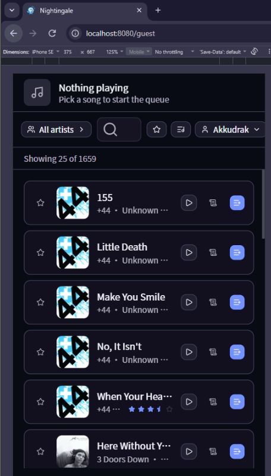
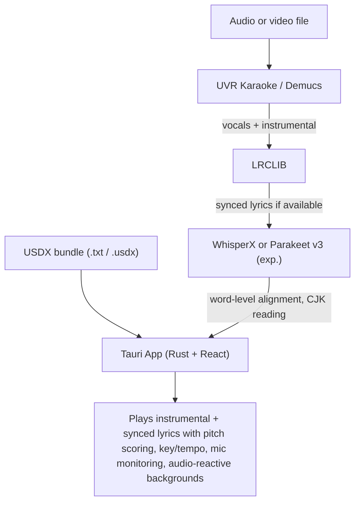

<p align="center">
  
</p>

<p align="center">
  Karaoke from any song in your music library, powered by neural networks.
</p>

<p align="center">
  <a href="https://github.com/rzru/nightingale/actions/workflows/release.yml"></a>
  <a href="https://hub.docker.com/r/razzaru/nightingale"></a>
  <a href="https://github.com/rzru/nightingale/stargazers"></a>
  <a href="LICENSE"></a>
  <a href="https://www.patreon.com/cw/nightingalekaraoke"></a>
  <a href="https://ko-fi.com/nightingalekaraoke"></a>
</p>

---

Nightingale scans your music folder, Plex Media Server, Jellyfin server, Navidrome server, or self-hosted web library; separates lead vocals from instrumentals using the [UVR Karaoke model](https://github.com/Anjok07/ultimatevocalremovergui) (or [Demucs](https://github.com/facebookresearch/demucs)); transcribes lyrics with word-level timestamps via [WhisperX](https://github.com/m-bain/whisperX); and plays it all back with synchronized highlighting, pitch scoring, key/tempo controls, profiles, and dynamic backgrounds.

Ships as a single binary. No manual installation of Python, ffmpeg, or ML models required — everything is downloaded and bootstrapped automatically on first launch.

## What's new in this fork

This fork turns Nightingale's self-hosted web mode into a first-class party-night experience for Windows, and ships a **Party Mode host** (`server.exe`) plus a slim guest page that any phone, tablet, or laptop on the same network can open without installing anything.

<table>
  <tr>
    <td align="center"></td>
    <td align="center"></td>
  </tr>
  <tr>
    <td align="center"><em><code>server.exe</code> — the host</em></td>
    <td align="center"><em><code>/guest</code> — what guests see</em></td>
  </tr>
</table>

Highlights:

- 🪩 **Party Mode** — the Windows self-hosted server (`server.exe`) and the `/guest` page are now the headline features. Host runs once, guests connect by URL.
- 🚀 **Server/Guest mode from desktop Settings** — a third option under **Playback mode** that closes the desktop, spawns the bundled `server.exe` on `0.0.0.0:8080` with the same data folder and library as the desktop, and auto-opens your browser to `/guest`. No command line, no second download — the desktop installer now bundles the server binary. The switch is gated behind an explicit confirmation dialog, and there is no way back from the web side: only relaunching the desktop shortcut returns to the GUI.
- 🎬 **YouTube fallback search + queue** — flip the YouTube chip in the search bar and the same query also hits the YouTube Data API; the top five hits render under a "From YouTube" separator with thumbnail, title, and channel. From any hit you can queue it for the karaoke visor (the queue sidebar and `/guest` drawer now render mixed `song | youtube` rows with the correct artwork and `Added by` attribution), and queue-driven YouTube sessions surface a **Skip** button plus an end-of-video **Next video** / **End of the queue** dialog that mirrors the song `ResultDialog`. Configure the Data API v3 key once in **Settings → Library**; the chip is a no-op without it.
- 🪟 **Portable Windows host binary** — single `.exe` for `x86_64-pc-windows-msvc`, embeds the React client via `rust-embed`, downloads ffmpeg + Python + ML models on first launch.
- 📱 **Self-service guest flow** — profile gate, library browse, search, artist drawer/sidebar, preview, queue, lyrics, favorites, scores — all from any modern browser.
- ⭐ **Per-profile favorites** — star toggle on every row with optimistic UI; new `Favorites` filter button in the header; persists to `ProfileStore`.
- 🏆 **Per-profile scores** — best-score `Stars` widget rendered inline on every row for the active profile.
- 📝 **Lyrics drawer** — one-tap side panel per row, reads cached lyrics or falls back to the AI transcript.
- 🎵 **Guide-vocal preview** — vocals mixed over the instrumental at reduced volume during preview, with two `<audio>` elements kept in drift-corrected sync.
- 🧾 **Queue with `Added by` attribution** — every entry remembers the profile that added it.
- 🔥 **Toast confirmation on each queue add** — guests get immediate feedback from the `Add to queue` action.

The original desktop app, all source connectors (folder, Plex, Jellyfin, Navidrome, USDX), stem separation, transcription, scoring, audio-reactive backgrounds, gamepad support, and adaptive UI are unchanged — Party Mode rides on top of the same core.

## Party Mode — throw a karaoke night from any device

**Party Mode is what happens when you point Nightingale's self-hosted server at a Windows PC on your home network**: the host runs the analysis once, then anyone with a phone, tablet, or laptop can connect to a guest page, pick a profile, queue songs, follow the lyrics, and track their scores — no installs, no accounts, just a URL.

The host's job is to keep the night running. Every guest device keeps the night running too:

🎤 **Self-hosted server in `server.exe`** — the same Rust crate that powers the Linux / Docker self-hosted build now produces a portable Windows binary. Extract the zip, double-click, get a local URL. First-run downloads ffmpeg + Python + ML models automatically; data persists under `%USERPROFILE%\.nightingale` (overridable via `--data` / `NIGHTINGALE_DATA_PATH`).

📱 **Guest page at `/guest`** — mobile-first, no app install. Guests pick their own profile, browse the analyzed library, preview tracks, and tap to add to the shared queue.

⭐ **Per-profile favorites** — every guest has their own starred list. Tap the star on any song to add it; the star fills instantly (optimistic UI) and persists across restarts. A `Favorites` filter button in the header narrows the library to just your starred songs.

🏆 **Per-profile scores** — every guest row shows the active profile's best score as a small star widget beside the artist line. Switch profiles and the star states flip to the new profile's favorites/scores; deleting a profile drops their stars and scores too.

📝 **Lyrics drawer** — each row has a `Lyrics` button that opens a side panel with the song's lyrics. Reads the cached lyrics file first; falls back to the AI transcript if no edited lyrics exist; shows a "ask the host to run analysis" empty state when neither is present.

🎵 **Guide vocal preview** — previewing a song in the guest library mixes the separated vocals over the instrumental at a reduced level (0.55) so guests can recognize the song before queuing it. The two audio elements stay in sync on seek/play/pause and on song change.

🧾 **Persistent queue with attribution** — every queue entry records the profile that added it, surfaced as `Added by <profile>` in the queue sidebar. The live now-playing bar sits in the header of the guest page so every connected device sees what's up next.

ℹ️ The Party Mode host on Windows is what the rest of Nightingale already does on Linux/Docker. The analysis pipeline, scoring engine, profile system, and source connectors are untouched — only the host runtime and the guest UI shifted.

## Features

### Library & sources

📁 **Folder library** — point at any folder and Nightingale scans supported audio, video, and UltraStar files inside.

🟠 **Plex** — connect to a local, remote, or LAN-only Plex Media Server, select one or more music libraries, and import tracks, associated music video clips, covers, and read-only playlists. Hosted Plex sign-in discovers servers; an advanced PMS URL + token flow works without plex.tv during normal operation.

🎬 **Jellyfin** — play straight from your Jellyfin library. Songs cache locally on first play so karaoke runs the same as a folder library.

💿 **Navidrome** — connect to Navidrome for audio libraries. Login details are kept encrypted on disk.

🪩 **Party Mode host (Windows / Linux / Docker)** — run the included `server` binary anywhere on your network and open `/guest` from phones, laptops, tablets, and TVs. Source doesn't matter — folder, Plex, Jellyfin, Navidrome, USDX — the guest page sees the same library. On Windows the desktop installer now bundles `server.exe` next to `Nightingale.exe`, and **Settings → Playback → Server/Guest mode** swaps the desktop for the host in one click (auto-opens your browser to `/guest`). See [docs/self-hosted](site/docs/src/self-hosted.md). Also runs in [Docker](site/docs/src/docker.md) (CPU or CUDA/GPU).

🧭 **Sidebar + library filters** — browse by quick filters, metadata cleanup buckets, artists, albums, and existing playlists from Plex, Jellyfin, Navidrome, or folder-library `.m3u` / `.m3u8` / `.pls` files. **Analyze All** and optional auto-analysis help queue your library faster, and the sidebar/song list remember scroll position when you come back.

🗂️ **Flexible storage** — choose the main data folder during setup, then split cache, models, videos, and vendor tools into separate folders from Settings when needed.

📦 **Self-contained** — ffmpeg, uv, Python, PyTorch, and ML packages are downloaded automatically during setup. Video backgrounds are pre-downloaded so the first session is ready to go.

### Lyrics & audio

🎤 **Stem separation** — isolates lead vocals from instrumentals using the UVR Karaoke model (default) or Demucs, with adjustable guide vocal volume. The karaoke model preserves backing vocals in the instrumental for a more natural sound.

📝 **Word-level lyrics** — automatic transcription with alignment, or fetched from [LRCLIB](https://lrclib.net) when available. Available to guests via the in-row `Lyrics` drawer.

✏️ **Lyrics editor with LRCLIB browser** — edit lyrics, browse LRCLIB matches, or paste your own **LRC / Enhanced LRC** from a song's Actions button. Timed LRC is used as-is (optionally skipping stem separation to sing over the original mix); plain lyrics run alignment.

🈯 **CJK lyric support** — Japanese, Chinese, Cantonese, and Korean songs get per-character forced alignment and romanized readings (Hepburn / pinyin / Jyutping / Revised Romanization) shown above each token.

🗣️ **Pluggable ASR engines** — choose Whisper (default, broad language coverage) or **Parakeet v3 (experimental)** for ~25 European languages, with NeMo on CUDA and ONNX Runtime everywhere else.

⚡ **Pluggable forced alignment** — keep WhisperX's aligner (default) or switch on an experimental backend: **GPU forced alignment** (torchaudio `forced_align`) for faster word timestamps on CUDA and Apple Silicon, or the **Qwen aligner** (Qwen3-ForcedAligner-0.6B) which timestamps 11 languages incl. CJK in a single pass on CUDA/MPS/CPU. Both fall back to WhisperX automatically.

🎼 **UltraStar Deluxe songs (experimental)** — drop USDX song folders (`.txt` or `.usdx` plus sibling audio/vocals/instrumental/video) into your library; pitch and lyric data come from the file directly, no analyzer pass needed. See [docs/usdx](site/docs/src/usdx.md).

### Playback & visuals

🎯 **Pitch scoring** — real-time microphone input with pitch detection, star ratings, and per-song scoreboards.

🎚️ **Key & tempo shifts** — adjust song key and tempo after analysis, with cached playback variants for quick retries.

🎬 **Video files** — drop video files (`.mp4`, `.mkv`, etc.) into your music folder; vocals are separated from the audio track and the original video plays as a synchronized background.

🌌 **Audio-reactive backgrounds** — 10 GPU shaders that react to your microphone in real time (Plasma, Waves, Nebula, Starfield, Sonar, Voronoi, Vortex, Metaballs, Spectrum, Oscilloscope), Pixabay video loops in 5 flavors (Nature, Underwater, Space, City, Countryside), plus source-video playback for video files.

🎙️ **Mic monitoring + latency test** — optionally route your live mic into playback, adjust monitor gain (0–200%), and run a beep-based latency test from Settings so scoring lines up with your room.

### Quality of life

👤 **Profiles** — create and switch between player profiles; scores and favorites are tracked per profile and kept in sync across all connected devices in Party Mode.

🎮 **Gamepad support** — full navigation and control via gamepad (D-pad, sticks, face buttons).

📺 **Adaptive + touch-friendly UI** — scales from phones/tablets to 4K TVs, with on-screen playback controls on touch devices.

⬆️ **In-app updates** — on macOS and Windows, auto-checks for new releases at launch, badges the sidebar avatar when one is available, and downloads and installs signed updates with one click. Linux is manual: the **Update** entry opens GitHub Releases for you to grab the new build.

## Quick start

### Party Mode (Windows)

**From the desktop app (one click, recommended):** launch Nightingale, open **Settings → Playback → Server/Guest mode**, confirm the dialog, and your browser auto-opens to `/guest`. The desktop quits, the bundled `server.exe` runs in the background, and any device on the LAN can connect. To return to the desktop, relaunch the desktop shortcut.

**Standalone (no desktop app required):**

1. Download the latest `nightingale-server-windows-x86_64.zip` from the [Releases](../../releases) page and extract it anywhere (e.g. `C:\Nightingale`).
2. Double-click `server.exe`. Windows SmartScreen will ask once; click **More info → Run anyway**.
3. The first launch downloads ffmpeg, Python, and the ML models (~1.5 GB), then opens `http://127.0.0.1:8080`.
4. Visit `http://127.0.0.1:8080/` to configure the host (pick data + library folders).
5. Visit `http://<your-pc-name>:8080/guest` from any phone or laptop on the same network — pick a profile and start queuing songs.

### Desktop app

Download the latest release for your platform from the [Releases](../../releases) page and run it. On first launch, Nightingale shows setup steps, lets you pick a data folder, then installs the Python environment and ML models automatically.

## Updates

On macOS and Windows, Nightingale checks for new releases once at launch. When one is available, the sidebar avatar grows a small green dot and the **Update** entry in the dropdown menu opens a dialog with the release notes. Click **Install & Restart** and the app downloads the signed bundle, installs it, and relaunches. On Windows the installer runs in `passive` mode — a small progress window flashes and the app comes back automatically once the install finishes.

### Linux

Auto-update is **not supported on Linux** — the app ships without the updater plugin. The **Update** entry still appears in the sidebar menu, but it just opens a dialog explaining this with a one-click button to the [Releases](../../releases) page so you can grab the new `.deb` or `.rpm` and install it the usual way for your distro.

### macOS

macOS quarantines files downloaded from the internet. Since Nightingale isn't signed with an Apple Developer ID, Gatekeeper will block it with a message like _"app is damaged and can't be opened"_. To fix this, remove the quarantine attribute after moving the Nightingale.app to Applications:

```bash
xattr -cr /Applications/Nightingale.app
```

### Supported formats

Audio: `.mp3`, `.flac`, `.ogg`, `.opus`, `.wav`, `.m4a`, `.aac`, `.wma`. Video: `.mp4`, `.mkv`, `.avi`, `.webm`, `.mov`, `.m4v`. UltraStar: `.usdx`, plus `.txt` files whose contents look like USDX.

## Controls

### Navigation

| Action           | Keyboard       | Gamepad            |
| ---------------- | -------------- | ------------------ |
| Move             | Arrow keys     | D-pad / Left stick |
| Confirm / Select | Enter          | A (South)          |
| Back / Cancel    | Escape         | B (East) / Start   |
| Switch panel     | Tab            | —                  |
| Search songs     | Type to filter | —                  |

### Playback

| Action                  | Keyboard          | Gamepad   |
| ----------------------- | ----------------- | --------- |
| Pause / Resume          | Space             | Start     |
| Exit to menu            | Escape            | B (East)  |
| Toggle guide vocals     | G                 | —         |
| Guide volume up/down    | + / -             | —         |
| Cycle background theme  | T                 | —         |
| Cycle video flavor      | F                 | —         |
| Toggle microphone       | M                 | —         |
| Next microphone         | N                 | —         |
| Toggle mic monitoring   | R                 | —         |
| Toggle fullscreen       | F11               | —         |
| Skip Intro / Skip Outro | On-screen buttons | A (South) |

## How it works



The analyzer runs as a persistent local process: Nightingale starts it once and talks to it over a token-authenticated loopback TCP socket using newline-delimited JSON, so per-song startup overhead (model load, CUDA init) is paid only once.

In Party Mode the desktop `Tauri App` is replaced by the cross-platform `server` binary — same analyzer pipeline, same Rust core, but the UI is the host's web/desktop interface plus a slim `/guest` page that any browser can open.

Analysis results are cached using blake3 file hashes. Re-analysis only happens if the source file changes, the user triggers it manually, or you choose to shift key/tempo and create playback variants. USDX songs skip stem separation entirely when `#VOCALS` and `#INSTRUMENTAL` are provided.

## Hardware

The Python analyzer uses PyTorch and auto-detects the best backend:

| Backend | Device        | Notes                                       |
| ------- | ------------- | ------------------------------------------- |
| CUDA    | NVIDIA GPU    | Fastest                                     |
| MPS     | Apple Silicon | macOS; WhisperX alignment falls back to CPU |
| CPU     | Any           | Slowest but always works                    |

The UVR Karaoke model uses ONNX Runtime and enables CUDA acceleration automatically on NVIDIA GPUs, or CoreML on Apple Silicon.

A song typically takes 2–5 minutes on GPU, 10–20 minutes on CPU.

## Data storage

During setup, you can choose where Nightingale stores data (default: `~/.nightingale` on Linux/macOS, `%USERPROFILE%\.nightingale` on Windows). Most runtime data is stored in that selected data folder, while `config.json` and `nightingale.log` remain in the default location.

Typical selected data folder layout:

```
<selected-data-folder>/
├── cache/               # Stems, transcripts, lyrics, shifted variants, covers, playable videos
├── songs.db             # SQLite song library and analysis metadata
├── profiles.json        # Player profiles, scores, and per-profile favorites (new in v1.3)
├── videos/              # Cached Pixabay video backgrounds
├── sounds/              # Sound effects (celebration)
├── vendor/
│   ├── ffmpeg           # Downloaded ffmpeg binary
│   ├── uv               # Downloaded uv binary
│   ├── python/          # Python 3.10 installed via uv
│   ├── venv/            # Virtual environment with ML packages
│   ├── analyzer/        # Extracted analyzer Python scripts
│   └── .ready           # Marker indicating setup is complete
└── models/
    ├── torch/           # Demucs model cache
    ├── huggingface/     # WhisperX model cache
    └── audio_separator/ # UVR Karaoke model cache
```

`~/.nightingale/config.json` stores app settings, including the selected data folder path.

### Video backgrounds

Pixabay video backgrounds use the [Pixabay API](https://pixabay.com/api/docs/). The API key is embedded in release builds. For development, create a `.env` file at the project root:

```
PIXABAY_API_KEY=your_key_here
```

## Building from source

### Prerequisites

| Tool       | Version                                                                                                               |
| ---------- | --------------------------------------------------------------------------------------------------------------------- |
| Rust       | 1.85+ (workspace uses edition 2024)                                                                                   |
| Node.js    | 20+                                                                                                                   |
| pnpm       | latest                                                                                                                |
| Linux only | `libwebkit2gtk-4.1-dev`, `libssl-dev`, `libayatana-appindicator3-dev`, `librsvg2-dev`, `libxdo-dev`, `libasound2-dev` |

### Development

```bash
git clone <repo-url> nightingale
cd nightingale
cargo desktop dev
```

### Release build

```bash
cargo desktop build
```

### Party Mode server only (no Tauri)

```bash
cargo build --release -p server
# → ./target/release/server(.exe)  --bind 127.0.0.1:8080 --data <path-to-data-folder>
```

The server binary embeds the React client bundle via `rust-embed`, so the SPA (and the `/guest` page inside it) is served from the same process.

## Supported platforms

| Platform       | Desktop app | Party Mode (`server`) |
| -------------- | ----------- | --------------------- |
| Linux x86_64   | ✅          | ✅                    |
| Linux aarch64  | ✅          | ✅                    |
| macOS ARM      | ✅          | ✅                    |
| macOS Intel    | ✅          | ✅                    |
| Windows x86_64 | ✅          | ✅ (new in v1.3) — also switchable from desktop Settings |

## Releasing

Releases are cut by [`.github/workflows/release.yml`](.github/workflows/release.yml) on any `v*` tag push. The workflow:

1. Verifies the tag matches the `version` in [`client/src-tauri/tauri.conf.json`](client/src-tauri/tauri.conf.json), [`client/src-tauri/Cargo.toml`](client/src-tauri/Cargo.toml), and [`client/package.json`](client/package.json).
2. Extracts the matching `## [<version>]` section from [`CHANGELOG.md`](CHANGELOG.md) as the release body.
3. Creates a draft release and, in parallel, builds and uploads:
   - Linux x86_64: `.deb`, `.rpm` (on `ubuntu-22.04`)
   - Linux aarch64: `.deb`, `.rpm` (on `ubuntu-24.04-arm`)
   - macOS ARM / Intel: `.dmg` + `.app.tar.gz` (+ `.sig`) for the in-app updater
   - Windows x86_64: `*-setup.exe` (NSIS, + `.sig`), `*_en-US.msi` (+ `.sig`)
   - Party Mode `server` zip per platform (`server-x86_64-pc-windows-msvc.zip`, `server-x86_64-unknown-linux-gnu.tar.gz`, etc.)
   - `latest.json` covering `darwin-aarch64`, `darwin-x86_64`, and `windows-x86_64` — Linux is intentionally absent since the updater plugin isn't compiled in for Linux.
4. Leaves the release as a draft. Smoke-test the artifacts from the draft, then flip it to **Published** with the "Set as the latest release" checkbox in the GitHub Releases UI to make `https://github.com/rzru/nightingale/releases/latest/download/latest.json` (the URL hard-coded in [`tauri.conf.json`](client/src-tauri/tauri.conf.json)) resolve to it and start rolling out the in-app update.

Cutting a release:

```bash
# bump versions in client/src-tauri/tauri.conf.json, client/src-tauri/Cargo.toml, client/package.json
# add a `## [<version>] - YYYY-MM-DD` section to CHANGELOG.md
git tag v<version>
git push origin v<version>
```

Required repository secrets:

| Secret                                | Purpose                                                                                                                            |
| ------------------------------------- | ---------------------------------------------------------------------------------------------------------------------------------- |
| `TAURI_SIGNING_PRIVATE_KEY`           | Minisign private key whose public counterpart is the `pubkey` in [`tauri.conf.json`](client/src-tauri/tauri.conf.json). Generate once with `pnpm tauri signer generate`. |
| `TAURI_SIGNING_PRIVATE_KEY_PASSWORD`  | Password for the signing key. Omit the secret entirely if the key was generated passwordless — GitHub rejects empty-string secrets, and a missing one resolves to empty at workflow runtime, which is what `minisign` expects. |
| `PIXABAY_API_KEY`                     | Embedded at compile time so release builds can fetch video backgrounds.                                                            |

## Contributing

Contributions are welcome, but Nightingale follows a **discussion-first** process:
before writing any code for a new feature or change, please
[start a discussion thread](https://github.com/rzru/nightingale/discussions) so we
can agree on whether it fits the app. Only once a discussion reaches **approved**
status will a corresponding pull request be accepted.

See [CONTRIBUTING.md](CONTRIBUTING.md) for the full workflow.

## Support the project

Nightingale is open-source, free, and built by one person in their spare time. If it brings you joy and you want to help keep development going, you can chip in:

- [Patreon](https://www.patreon.com/cw/nightingalekaraoke) — recurring monthly support.
- [Ko-fi](https://ko-fi.com/nightingalekaraoke) — one-off tip, no account required.

Every bit helps cover site hosting, hardware for testing, and the time spent shipping new features. Thank you.

## License

GPL-3.0-or-later — see [LICENSE](LICENSE).
